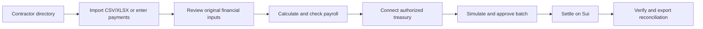
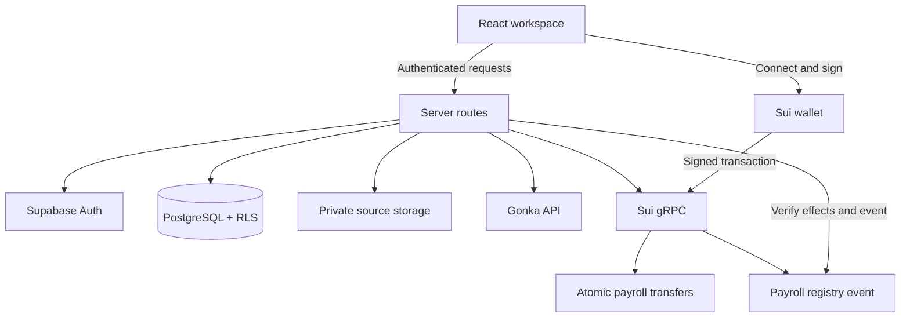

# ◈ Suiroll

### AI prepares payroll. You approve. Sui settles.

Suiroll is a non-custodial contractor payroll workspace for teams paying in USDC on Sui. It turns spreadsheets and manual wallet transfers into a controlled flow for importing payroll, reviewing exceptions, approving a payment batch, and reconciling the result.

Built for startups, agencies, DAOs, and remote-first teams, Suiroll helps operators spend less time preparing payments while keeping every financial decision under human control.

> **Project status:** Hackathon build configured and validated on Sui testnet. Use testnet funds for evaluation. Review the [current limitations](#current-limitations) before considering a production deployment.

## Why Suiroll?

Paying a distributed team often involves a spreadsheet, copied wallet addresses, repeated transfers, and manual reconciliation. That process is slow, difficult to audit, and vulnerable to expensive mistakes.

Suiroll brings the workflow into one place:

- Import the CSV or Excel file the team already uses.
- Match payments to a reusable contractor directory.
- Make bonuses, deductions, taxes, fees, currency rates, and source notes explicit.
- Flag unusual payments and exclude duplicate or previously paid invoices.
- Lock the reviewed payment plan before approval.
- Check treasury funds and simulate the complete payment before signing.
- Pay every recipient in one wallet-authorized batch.
- Verify the final balance changes and export a reconciliation ledger.

AI assists with understanding the source; it does not control funds, invent financial values, or approve payments.

## Product workflow



### 1. Manage contractors

Store each contractor's name, department, base compensation, status, and verified Sui wallet. Contractor details can be reused across payroll runs, and completed payments appear in each contractor's history.

### 2. Create a payroll run

Upload a `.csv` or `.xlsx` file of up to 250 records and 2 MB, or enter payments manually. Suiroll preserves the original source and uses Gonka to map source columns into a structured review—not to decide payment amounts.

### 3. Review and calculate

An operator explicitly confirms contractor matches, base pay, bonuses, reimbursements, deductions, taxes, fees, currencies, exchange rates, notes, and zero values. Exact integer arithmetic then creates the payment plan and surfaces findings such as:

- Duplicate or previously paid invoices
- Conflicting invoice inputs
- Missing or shared wallets
- Payments above the organization's policy limit
- Payments more than 50% above base compensation
- Source notes requiring review
- Invalid or non-positive payment totals

### 4. Check readiness and approve

Suiroll verifies the connected treasury, stablecoin configuration, balance, gas availability, registry state, contractor wallets, and complete simulated transaction. The authorized wallet then signs the exact prepared batch. Suiroll never stores a seed phrase or private key.

### 5. Settle and reconcile

Transfers and the payroll registry record execute in the same Sui Programmable Transaction Block. After submission, Suiroll compares recipient and treasury balance changes with the approved plan and validates the registry event. A confirmed payroll can be viewed in a Sui explorer and exported as CSV.

## Features

### Payroll operations

- Overview dashboard with active payroll, contractor, approval, and reconciliation metrics
- Contractor directory and contractor payment history
- CSV/XLSX import and manual payment entry
- Original source storage and time-limited source download
- Explicit review of all financial inputs
- Exact fixed-point calculation using `bigint`
- Bonuses, reimbursements, deductions, taxes, fees, and operator-supplied FX rates
- Organization-level maximum-payment policy
- Payroll lifecycle from draft through paid or failed
- Settlement ledger with detailed payroll views and CSV export
- Insights for duplicate invoices, findings, and completed AI operations
- Responsive navigation with light, dark, and system themes

### AI assistance

- Gonka-powered source-column mapping
- Source-note interpretation with evidence preserved
- Short summaries of already-validated payroll plans
- Strict schema validation with Zod
- Bounded timeouts, retries, persisted checkpoints, and output hashes
- Prompt-injection-aware handling of imported source text

AI output never directly changes a wallet, recipient, or financial amount. Deterministic application code performs all calculations and payment checks.

### Payments and controls

- Official Sui dApp Kit wallet connection
- USDC payroll settlement on a configured Sui network
- One atomic batch for registry recording and contractor transfers
- SHA-256 commitments for immutable payment and payroll plans
- Pre-signing transaction simulation
- Exact transaction-byte approval and treasury signature verification
- Duplicate-invoice exclusion and concurrent invoice reservations
- Transaction digest persistence before network submission
- Post-settlement balance-change and event verification
- Recovery flow for pending or confirmed-failed transactions

### Workspace security

- Supabase email/password authentication
- Private payroll source storage
- Organization isolation with Row Level Security
- Server-side, role-checked financial mutations
- Owner, admin, approver, and viewer roles
- Audit trail for important workspace and payroll actions
- Sample workspace is read-only and cannot submit payments

## Roles

| Role | Capabilities |
| --- | --- |
| Owner | Full workspace access, payroll preparation and approval, settings, and role management |
| Admin | Manage contractors, prepare payroll, update settings, and approve payments |
| Approver | Review readiness, authorize payments, and reconcile settlements |
| Viewer | Read workspace, treasury, source, and settlement information |

## Technology stack

| Layer | Technology |
| --- | --- |
| Application | React 19, TypeScript, Next-compatible App Router through Vinext |
| UI | Tailwind CSS 4, Base UI, shadcn components, Lucide icons, Recharts |
| Hosting/runtime | OpenAI Sites, Vite, Cloudflare Workers |
| Authentication and data | Supabase Auth, PostgreSQL, Row Level Security, Supabase Storage |
| Validation | Zod |
| Spreadsheet import | Papa Parse, `read-excel-file` |
| AI | Gonka through a schema-constrained provider abstraction |
| Blockchain | Sui TypeScript SDK, gRPC client, official dApp Kit |
| Smart contract | Sui Move payroll registry |
| Testing and quality | Vitest, TypeScript, Oxlint, Oxfmt, Sui Move tests |

## Architecture



Private financial state is changed only through authenticated server routes. Browser clients receive a publishable Supabase key for authentication and read access; service credentials and AI keys remain server-side.

## Getting started

### Prerequisites

- [Node.js](https://nodejs.org/) 22.13 or newer
- npm
- A [Supabase](https://supabase.com/) project
- A compatible Sui wallet and a treasury address
- A deployed payroll registry, its `AdminCap`, and the chosen USDC coin type
- A Gonka-compatible API endpoint, API key, and model
- Optional: the [Sui CLI](https://docs.sui.io/guides/developer/getting-started/sui-install) to run Move tests

### 1. Clone and install

```bash
git clone https://github.com/DayDreamingLab/suirollpay.git
cd suirollpay
npm install
```

### 2. Configure the environment

Copy `.env.example` to `.env.local` and fill in the required values.

```bash
cp .env.example .env.local
```

PowerShell:

```powershell
Copy-Item .env.example .env.local
```

The development script can also synchronize an `.env.local` stored one directory above the project. Do not commit real credentials.

#### Supabase

| Variable | Description |
| --- | --- |
| `NEXT_PUBLIC_SUPABASE_URL` | Supabase project URL |
| `NEXT_PUBLIC_SUPABASE_PUBLISHABLE_KEY` | Browser-safe publishable key |
| `SUPABASE_SECRET_KEY` | Server-only Supabase secret key |

#### Sui and payroll settlement

| Variable | Description |
| --- | --- |
| `NEXT_PUBLIC_SUI_NETWORK` | `testnet`, `devnet`, or `mainnet` |
| `NEXT_PUBLIC_SUI_RPC_URL` | Sui gRPC endpoint |
| `NEXT_PUBLIC_PAYROLL_PACKAGE_ID` | Package containing `payroll_registry` |
| `NEXT_PUBLIC_PAYROLL_REGISTRY_ID` | Shared registry object ID |
| `NEXT_PUBLIC_PAYROLL_ADMIN_CAP_ID` | Treasury-owned registry capability object ID |
| `NEXT_PUBLIC_USDC_TYPE` | Full Move type for the settlement coin |
| `NEXT_PUBLIC_USDC_DECIMALS` | Coin decimals; defaults to `6` |
| `PAYROLL_TREASURY_ADDRESS` | Server-configured wallet authorized to pay payroll |

#### Gonka

| Variable | Description |
| --- | --- |
| `GONKA_API_BASE_URL` | Provider base URL |
| `GONKA_API_KEY` | Server-only provider credential |
| `GONKA_MODEL` | Model identifier exposed by the provider |
| `AI_REQUEST_TIMEOUT_MS` | Request timeout; defaults to `45000` and is capped at `90000` |
| `AI_MAX_OUTPUT_TOKENS` | Maximum output; defaults to `1500` and is capped at `4000` |
| `AI_MAX_RETRIES` | Retry count; defaults to `2` and is capped at `3` |

Only variables prefixed with `NEXT_PUBLIC_` are exposed to the browser. Never put a service credential, API key, private key, or seed phrase in a public variable.

### 3. Set up Supabase

In the Supabase SQL Editor, apply these migrations in order:

1. [`supabase/migrations/001_initial.sql`](supabase/migrations/001_initial.sql)
2. [`supabase/migrations/002_approval_reservations.sql`](supabase/migrations/002_approval_reservations.sql)

The migrations create the organization, membership, contractor, payroll, AI-operation, approval, transaction, invoice, and audit tables; private source storage; RLS policies; and the approval/reconciliation database functions.

In **Authentication → URL Configuration**, add the local and deployed application origins to the allowed redirect URLs so account confirmation and password recovery work correctly.

### 4. Run the application

```bash
npm run dev
```

Open the local URL printed by the development server. Create an account, create a workspace, verify the treasury configuration, and add contractors with testnet wallet addresses.

## Demo walkthrough

1. Open the read-only sample workspace to explore the product.
2. Sign in and create an organization.
3. Add active contractors with independently verified Sui wallet addresses.
4. Fund the configured treasury with testnet USDC and at least `0.03 SUI` for the configured maximum gas budget.
5. Create a payroll from a CSV/XLSX file or choose **Load small testnet scenario** during manual entry.
6. Review every imported field and confirm the financial inputs.
7. Show how a repeated invoice is excluded and an unusually large payment is surfaced for review.
8. Connect the configured treasury wallet and select **Check payment readiness**.
9. Select **Approve & Pay**, verify the wallet prompt, and sign the batch.
10. Wait for reconciliation, open the explorer transaction, and export the settlement CSV.

A timed, market-focused recording script is available in [`docs/DEMO_SCRIPT_4_MIN.md`](docs/DEMO_SCRIPT_4_MIN.md).

## Testing and validation

Run the standard checks:

```bash
npm run typecheck
npm run lint
npm test
npm run build
```

Run the Move tests when the Sui CLI is installed:

```bash
sui move test --path move
```

Live checks are opt-in because they use configured external services. They simulate a real Sui payment but do not submit it:

```powershell
$env:RUN_LIVE_CHECKS='1'
npx vitest run tests/live-simulation.test.ts
```

Additional integration scripts validate Supabase isolation and the authenticated API workflow against configured services. Review each script before running it because it creates and removes temporary validation records:

```bash
node scripts/integration-check.mjs
node scripts/api-validation.mjs
```

The repository includes tests for exact arithmetic, duplicate handling, payment-plan commitments, AI JSON parsing, signature verification, persistence, Sui effects, registry events, and live simulation.

## Available scripts

| Command | Purpose |
| --- | --- |
| `npm run dev` | Start the local Vinext development server |
| `npm run build` | Create a production build |
| `npm run start` | Run the built Cloudflare Worker locally with Wrangler |
| `npm run typecheck` | Run TypeScript without emitting files |
| `npm run lint` | Run Oxlint |
| `npm run format` | Format the project with Oxfmt |
| `npm test` | Run the Vitest suite once |

## Project structure

```text
app/                         Application routes and server API endpoints
components/                  Workspace views and reusable UI components
docs/                        Demo, setup, status, and validation artifacts
hooks/                       Client-side React hooks
lib/ai/                      Gonka provider and structured AI operations
lib/domain/                  Payroll types, money utilities, and calculation engine
lib/server/                  Authentication, persistence, payroll, and payment services
lib/sui/                     Transaction construction and settlement verification
move/                        Reference Sui Move registry package and tests
public/                      Static application assets
scripts/                     Environment and integration validation utilities
supabase/migrations/         Database, RLS, storage, approval, and reconciliation setup
tests/                       Unit, security, persistence, and settlement tests
```

## Security model

- **Non-custodial:** only the configured treasury wallet can authorize payment.
- **Human approval:** AI cannot sign or submit a transaction.
- **Immutable plan:** a SHA-256 commitment detects any change after review.
- **Exact approval:** the server verifies the signature against the prepared transaction bytes and treasury address.
- **Preflight protection:** configuration, balances, wallets, policy rules, registry state, and simulated effects are checked before approval.
- **Duplicate protection:** paid invoices are excluded, and invoice claims prevent concurrent payrolls from approving the same invoice.
- **Recoverable submission:** the deterministic transaction digest is stored before sending, preventing an uncertain network response from causing a blind retry.
- **Verified settlement:** expected USDC balance changes and the typed registry event must match the approved plan.
- **Private data:** Supabase RLS isolates organizations, source files are private, and financial writes use authenticated role-checked routes.

This repository does not require or store wallet private keys. Never add seed phrases, private keys, service credentials, or real payroll data to the repository.

## Current limitations

- The current project is a hackathon build validated on Sui testnet, not a production payroll or tax service.
- CSV and XLSX imports are supported; PDF/OCR invoices and email ingestion are not implemented.
- Taxes and FX rates are entered and verified by the operator. Suiroll does not calculate jurisdiction-specific tax or retrieve market exchange rates.
- Roles are supported, but self-service team invitations are not yet implemented.
- Additional members must currently be provisioned by the project administrator in Supabase.
- AI retries are explicit; there is no always-on background job worker.
- The Move source in `move/` is a reference implementation matching the deployed public ABI and is not claimed to be the exact source of an existing deployment.
- A production deployment requires an independent security review, operational monitoring, recovery procedures, and legal/compliance assessment for the intended jurisdictions.

## Documentation

- [`docs/IMPLEMENTATION_STATUS.md`](docs/IMPLEMENTATION_STATUS.md) — implementation scope and validation status
- [`docs/SETUP_REQUIRED.md`](docs/SETUP_REQUIRED.md) — external configuration checklist
- [`docs/DEMO_SCRIPT_4_MIN.md`](docs/DEMO_SCRIPT_4_MIN.md) — standalone four-minute product demo script
- [`move/sources/payroll_registry.move`](move/sources/payroll_registry.move) — reference registry module

---

**Suiroll** — prepare with clarity, approve with control, and reconcile with confidence.
